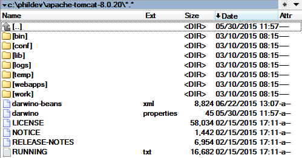

Darwino configuration files for a J2EE environment
--------------------------------------------------

The files should be first customized to you environment (database, directory...).

**Apache TOMCAT**
The simplest is to copy these files to the root or your TOMCAT Home directory `[Tomcat Home Directory]`. The `conf` subdirectory is also an option, if you want to use multiple and specific configurations.

